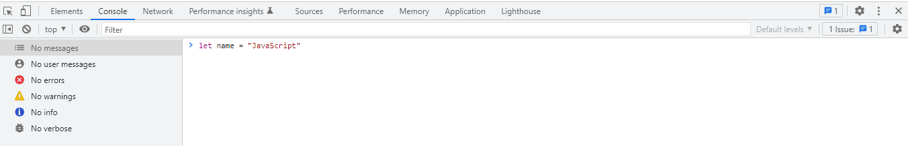
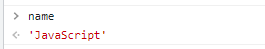

# JavaScript教程

2022年随着疫情的发展经济每况愈下各行各业受到严重打击，计算机行业已经成为了受影响较小的行业之一。学习一门编程语言是入门计算机行业的必备，JavaScript做为前端技术的基础是很值得学习的。

## 1 基础

在基础环节我们只会学习最基础的概念，并不会考虑很多特殊情况，您只需要学习到最简单的JavaScript知识就可以了。

### 1.1 代码的运行环境和调试
很多人在学习编程时会被繁琐的运行环境配置劝退，JavaScript的运行环境格外简单，只要是有浏览器在任何设备上都可以运行。

打开浏览器这里推荐使用chrome或fireFox，按下F12键你可以看到弹出了一个窗口


这个窗口就是浏览器自带的调试器，在这里您可以进行代码的调试。使用方法很简单，在这里只介绍console（控制台）菜单其他菜单后续教程中接受。

点击console您就可以在控制台中输入JavaScript代码并且按下回车键执行它。

### 1.2 变量
#### 1.2.1 变量的创建
在控制台中输入 `let name = "JavaScript"` 按下回车

如图：



这样您就通过关键字 ```let``` 创建了一个名为 ```name``` 的变量，变量中储存的值为 ```"JavaScript"``` 注意 引号代表它是一个 ***字符串*** 类型的变量。

在JavaScript中有很多关键字，代表着一些特殊的意义比如刚才用到的 ```let``` 当我们创建变量时一定要注意避开他们否则将出现错误。

要使用变量非常简单，只要输入变量名就可以使用它了。

在控制台中输入 `name`



控制台就使用了这个变量并将变量的值打印了出来

#### 1.2.2 变量的类型
我们现在创建的名为 ***name*** 的变量是一个 ***字符串*** 类型的变量，顾名思义它是一串字。

在JavaScript中数据类型是自动判断的根据你输入的值将会自动判断数据类型。JavaScript中主要有8种数据类型分别为：string（字符串）、number（数字）、boolean（布尔值）、null（空）、undefined（未定义）、array（数组）、object（对象）、function（函数）。

其中数组，对象，函数会在后边的教程中详细介绍，我们现来了解最常用的三种类型 string、number、boolean。

***string***

string字符串类型，定义一个字符串变量使用双引号（"）或单引号（'）将内容包裹起来就构成了一个字符串比如 ```let name = "JavaScript"```或 ```let name = 'JavaScript'```

***number***

定义数字类型非常简单你只需要输入数字就可以了，比如```let ten = 10```这样你就定义了一个变量名为 ***ten*** 值为 ***10*** 的数字变量。

***boolean***

boolean 布尔类型只有两个值 ***true*** 和 ***false***，其中  ***true*** 代表真 ***false*** 代表假 ，boolean类型主要在判断中出现。

定义布尔类型变量 ```let isTrue = true``` 或 ``` let isFalse = false ```

***null***

null代表什么都没有 其变量值即为 ***null***

***undefined***

undefined代表什么都没有 其变量值即为 ***undefined***

***array***

数组我们会在后面介绍其详细内容

***ojbect***

对象我们会在后面介绍其详细内容

***function***

函数我们会在后面介绍其详细内容

### 1.2 逻辑

在代码中逻辑是最烧脑的一部分也是代码中最关键的一部分，如果想要实现某一些功能那么逻辑是绝对少不了的。

在第一节里面我们学习了变量的创建，当变量创建完成后这些变量便会被后面的代码所使用（如果一个变量创建后不会被使用，那么创建它便是多余的），而使用这些代码的方式便被称为代码逻辑。

#### 1.2.1 运算

运算是通过一些方式获取到我们想要的值，比如将两个数字类型的变量相乘就是一种运算。
``` JavaScript
let one = 1
let two = 2
let three = one + two
```
猜猜 ***three*** 变量的值为多少

***算术运算符***

算术运算符的作用主要用于数字的计算

**加号运算符**

``` + ``` 运算符代表将两个数字类型变量相加，将两个字符串类型变量拼接。如果是一个字符串类型和另一个其他类型相 ```+``` 效果也会为拼接。

$variable = x + y$

如：
``` JavaScript
 let str1 = "Java"
 let str2 = "Script"
 let num1 = 1
 let num2 = 2
```
``num1 + num2`` 的值为 ``3``

``str1 + str2`` 的值为 ``"JavaScript"``

``str1 + num1`` 的值为 ``"Java1"`` **注意** 在这里数字类型的 ```1``` 被隐式转换为字符串类型并且拼接到了一起，在使用 ```+``` 号时要格外注意这个问题。

``++`` 两个加号代表在数字本身基础上加1
```JavaScript
let num = 1
++num
//num 值为 2
```

``+=`` 代表在自身基础上加上某一个值，等价于 ``x = x + y``
```JavaScript
let num = 1
num += 3+1
```
num 最终等于 5

**减法运算符**

```-``` 运算符代表将两个数字相减，如果不是数字类型的话讲返回 ```NaN``` （not a number）

$variable = x - y$

``let num = 2 - 1 `` num的值为1

``--`` 两个减号代表在数字本身基础上减1

```JavaScript
let num = 1
--num
//num 值为 0
```
``-=`` 代表在自身基础上**减**某一个值，等价于``x = x - y``
```JavaScript
let num = 4
num -= 2-1
```
num 最终等于 3


**乘法运算符**

```*``` 运算符代表将两个数字**相乘**，如果不是数字类型的话讲返回 ```NaN``` （not a number）

$variable = x * y$

``let num = 5 * 4`` num的值为20

``**`` 两个``*``代表**阶乘**

```let num = 4**2``` num的值为 $4^2$ = 16

``*=``代表在自身基础上**乘**某一个值，等价于 ``x = x*y``
```JavaScript
let num = 4
num *= 5
```
num 最终等于 20

**除法运算符**

```/``` 运算符代表将两个数字**相除**，如果不是数字类型的话讲返回 ```NaN``` （not a number）

$variable = x / y$

``` JavaScript
let num = 4 / 2
//num 值为 2
```

``/=``代表在自身基础上**除**某一个值，等价于 ``x = x/y``
```JavaScript
let num = 4
num /= 2
```
num 最终等于 2

**模除运算符**

```%``` 运算符代表将两个数字**模除**（只保留余数），如果不是数字类型的话讲返回 ```NaN``` （not a number）

``` JavaScript
let num = 5 % 2
//num 值为 1
```
``%=``代表在自身基础上**模除**某一个值，等价于 ``x = x%y``
```JavaScript
let num = 5
num %= 2
```
num 最终等于 1


#### 1.2.2 if 和 else

if在英语中的意思是如果，它的使用离不开我们上一节讲到的boolean布尔类型